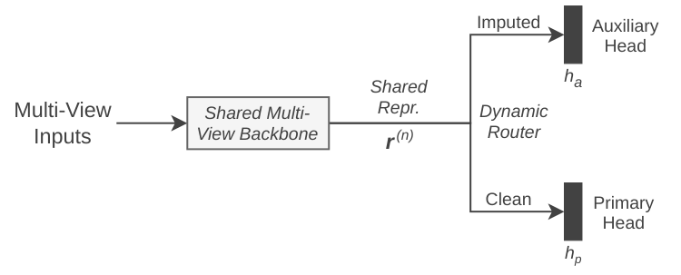

* Incomplete Multi-View Learning
Official code repository for the master's thesis in Applied Sciences and Engineering: Computer Science (AI) at the Vrije Universiteit Brussel (VUB).

Thesis subject: Incomplete Multi-View Learning, A Two-Head Architecture for Robust Missing Data Handling. 

** Abstract
Multi-view machine learning systems increasingly depend on the simultaneous availability of multiple sensor streams, yet real-world deployments often violate this assumption through hardware failure, environmental interference, and transmission loss. The standard approach is to either drop or impute the missing views, so that the classifier receives a supposedly complete input. This thesis identifies and addresses a consequence of imputation that has received insufficient attention: imputed views do not follow the same statistical distribution as genuine sensor readings. Mixing clean and imputed samples in a single training set forces the shared classifier to simultaneously satisfy two incompatible gradient signals. This gradient conflict degrades the learned decision boundary in proportion to the severity of the distributional mismatch.

To resolve this structurally, this thesis adapts the two-head multi-task framework of Zhang and Ma to the incomplete multi-view setting. A shared backbone processes all samples jointly, while a routing mechanism directs complete samples to a primary classification head and imputed samples to an auxiliary head. This separation ensures the primary head's gradient signal is never contaminated by synthetic inputs, while the backbone continues to receive updates from the full dataset through the auxiliary pathway.

The architecture is evaluated across four benchmark datasets (ModelNet40, SensIT Vehicle, UCI-HAR, and the YouTube Multiview Video Games Dataset), under four imputation strategies, four fusion configurations, and multiple missing rates. The two-head architecture consistently and significantly outperforms the single-head baseline, with gains that scale increasingly with missing rate and inversely with imputation quality. Gradient alignment analysis confirms that the cosine similarity between clean and imputed gradient signals remains persistently near zero throughout training regardless of imputation method. This provides direct evidence that the conflict is inherent to the data mixing rather than to reconstruction quality. A computational analysis demonstrates that these gains come at negligible parameter and computational overhead, resulting in a practically deployable solution for incomplete multi-view learning.

** Two-Head Multi-Task Architecture

** Structure
#+begin_src text
  .
  ├── data                           # Data storage
  │   └── features                   # Extracted features from datasets
  ├── LICENSE                        # Project license
  ├── pyproject.toml                 # Project metadata and dependencies (e.g., uv config)
  ├── README.org                     # Main project documentation
  └── src                            # Main source code package
      ├── centralized                # Core thesis experiments (Multi-view learning)
      │   ├── config.py              # Hardware and device setup
      │   ├── data_setup.py          # Dataloaders and missing data wrappers
      │   ├── experiments.py         # Thesis experiment logic
      │   ├── main.py                # Clean execution entry point
      │   ├── train.py               # PyTorch training loops
      │   ├── utils.py               # Centralized helper functions
      │   ├── scripts                # Utility scripts for checking and plotting
      │   │   ├── imputation_check.py
      │   │   └── plot_fusions.py
      │   └── results                # Results generated from experiments
      │       └── 2head_v1           # Plots and evaluations for 2-head architecture
      │           ├── exp1_grad_sim  # Gradient similarity plots across datasets
      │           │   └── ...        # (*.png files)
      │           └── ...
      │
      └── core                       # Shared ML assets and neural backbones
          ├── cpm_nets.py            # CPM generative imputation logic
          ├── data.py                # Missing data logic & matrix generation
          ├── datasets.py            # Multi-view dataset definitions
          ├── dcp_nets.py            # DCP generative imputation logic
          ├── models.py              # Neural backbones
          ├── train.py               # Core model training logic
          └── utils.py               # Shared core helper functions
#+end_src

** Reproducing the Experiments
*** Environment Setup
This thesis uses [[https://github.com/astral-sh/uv][uv]] for Python dependency management.

#+begin_src bash
  # Install dependencies and create a virtual environment
  uv sync
  source .venv/bin/activate
#+end_src

*** Data Preparation
Due to size and licensing restrictions, the raw datasets and extracted feature matrices are not included in this repository. To run the experiments, please download the respective files from their official sources and place them in the ~data/~ directory as outlined below.

*1. ModelNet40*
- *Source:* [[https://github.com/iMoonLab/HGNN][iMoonLab/HGNN GitHub Repository]]
- *Instructions:* Navigate to the "Usage" section of their README and download the ~ModelNet40_mvcnn_gvcnn_feature~ file (hosted on Google Drive).
- *Placement:* Save the ~.mat~ file as ~data/features/ModelNet40_mvcnn_gvcnn.mat~.

*2. SensIT Vehicle (Acoustic/Seismic)*
- *Source:* [[https://www.csie.ntu.edu.tw/~cjlin/libsvmtools/datasets/multiclass.html][LIBSVM Data Repository]]
- *Instructions:* Scroll to the "SensIT Vehicle (acoustic)" and "SensIT Vehicle (seismic)" sections. Download the training and testing files for both modalities.
- *Placement:* Save the four files (~acoustic~, ~acoustic.t~, ~seismic~, ~seismic.t~) in ~data/features/sensit_vehicle_features/~.

*3. UCI Human Activity Recognition (UCI-HAR)*
- *Source:* [[https://archive.ics.uci.edu/dataset/240/human+activity+recognition+using+smartphones][UCI Machine Learning Repository - HAR]]
- *Instructions:* Click "Download" and extract the ~.zip~ archive.
- *Placement:* Place the extracted contents into ~data/features/uci_har_dataset/~.

*4. YouTube Multiview Video Games Dataset*
- *Source:* [[https://archive.ics.uci.edu/dataset/269/youtube+multiview+video+games+dataset][UCI Machine Learning Repository - YouTube Multiview]]
- *Instructions:* Click "Download" and extract the ~.zip~ archive.
- *Placement:* Place the extracted contents into ~data/features/youtube/~.

*** Running the code
You can run any of the thesis experiments directly from the command line using ~main.py~.

*To reproduce the main accuracy tables:* \\
#+begin_src bash
  uv run python src/centralized/main.py --experiment generate_results --dataset modelnet --fusion_type mid_late --imputation_type zero
#+end_src

*To test the robustness of the fusion by dropping views at inference time:* \\
#+begin_src bash
  uv run python src/centralized/main.py --experiment inference_drop --dataset youtube
#+end_src

*To generate the gradient conflict scaling graphs:* \\
#+begin_src bash
  uv run python src/centralized/main.py --experiment grad_sim_vs_missing --dataset har --imputation_type cpm
#+end_src

** Disclaimer
Almost all this code is written by hand and went through multiple phases while writing my thesis. Everything is tested on an Arch Linux machine, but it is possible that some features or experiments need some small changes to make them work as expected. This is research code, not an optimized or perfectly written Python package.

** Citation
If you find this code or thesis useful in your research, cite this work:
(TODO if published hopefully...)

** License
This thesis is licensed under the MIT License. See the ~LICENSE~ file for details.
